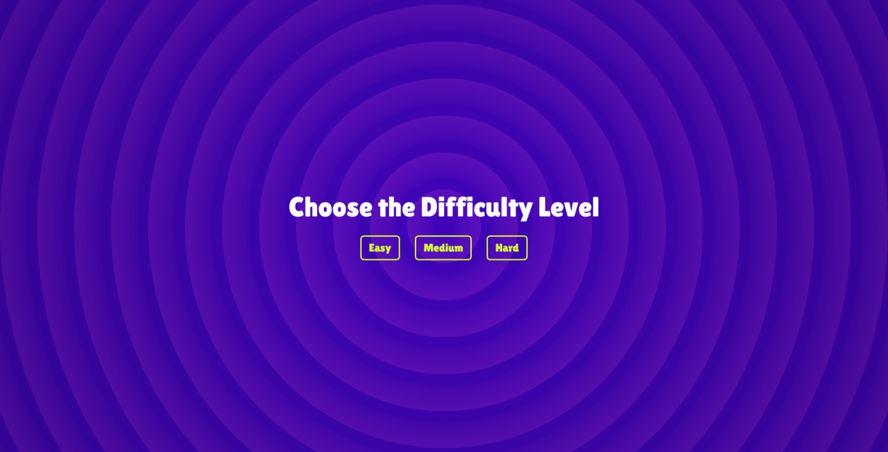
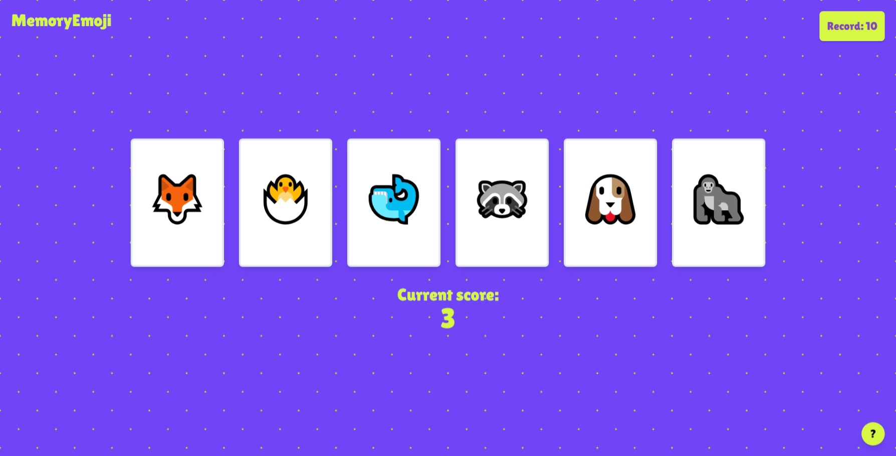

# Game of memory cards - MemoryEmoji
- **Important Note**: the most up-to-date version of this project can be found in the branch **[vite](https://github.com/iaaron-xyz/memory-game/tree/vite)**.
## About the Game
- Every turn, you must choose 1 card among a group of them; you can choose anyone you like.
- Once you pick one, all the cards get shuffled, including the picked one.
- You must choose another card that is different from the previous one.
- Once a card is selected, the player can't select it again during the rest of the game.
- If you repeat a card, you lose.

Check the live demo and play *[here](https://memory-emoji-cards.netlify.app/)*.

## Project Captures




## How to run the project (old - create-react-app)
To run the project:
1. Donwload the repository
```
https://github.com/iaaron-xyz/memory-game.git
```

2. Move to the downloaded folder
```
cd memory-game
```

3. Install the necessary dependencies listed in `package.json`
```
npm install
```

4. Run the project in development mode
```
npm run start
```

5. Open the project in [http://localhost:3000](http://localhost:3000).